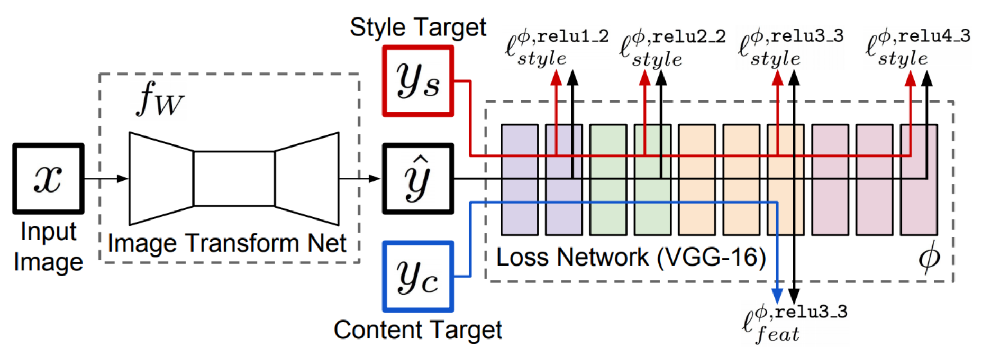
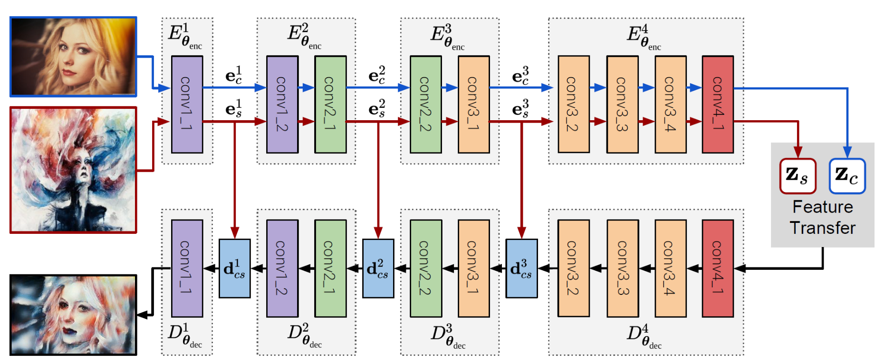
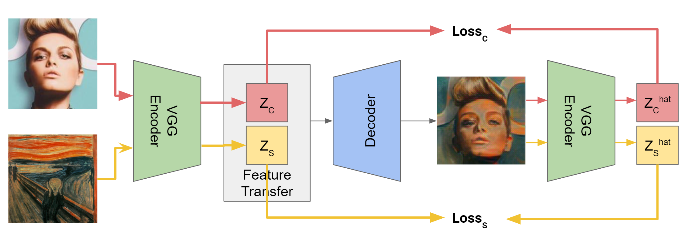
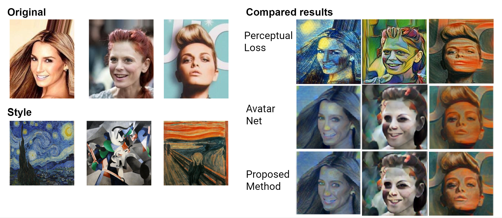

# Zero-Shot-Image-Style-Transfer
Author: Nicolas Hu, Yihang Xin

## Oerview 
### Perceptual Loss 
- Perceptual loss style transfer network is in the perceptual_loss folder.
- Use perceptual_loss.ipynb to transfer the image style. Put original images in the image folder. 
- Put pretrained model in the same folder with .ipynb.
- The processed image is saved in the outputs folder.

### Avatar-Net
- Avatar-Net and proposed method are in the avatar_net_and_proposed_method folder.
- Use Avatar_Net.ipynb to transfer the image style. 
- avatar.pth is the pretrained model for Avatar-Net. 

### Proposed Method
- Use Proposed_Method.ipynb to transfer the image style.
- proposed.pth is the pretrained model for Proposed_Method. 
- If you want to use new datasets to train the model, please use the train.ipynb and put the new dataset
in the same folder with train.ipynb.
- You can add new styles to the style folder, and add new images to the image folder. 
proposed

## Abstract 
- Zero shot image style transfer is an image synthesis problem that change an image’s style using another arbitrary image. 
Recent work shows that style and content can be successfully extracted by convolutional neural networks. 
However, the trade off between efficiency and visual quality of images prohibits the development of a zero shot image style transfer in real time. 

- Existing methods either apply 
  - (i) an optimization based method that is not efficient, 
  - (ii) an efficient feed forward network that only allows a limited number of trained styles, or 
  - (iii) a zero shot feed forward network with impaired quality. 
- We propose to use a new loss function that only uses feature space information. 
The results of the proposed method show similar training process and perceptual quality of output images as avatar-net. And it has higher efficiency. This proves that our proposed method is a good simpler alternative of perceptual loss. 

## Results 
- [Presentation Link](https://docs.google.com/presentation/d/1jQWtSjd6Y1H9FeuHQEuKOgEE4PBP7_oRh4H8uOTbV-g/edit?usp=sharing)

